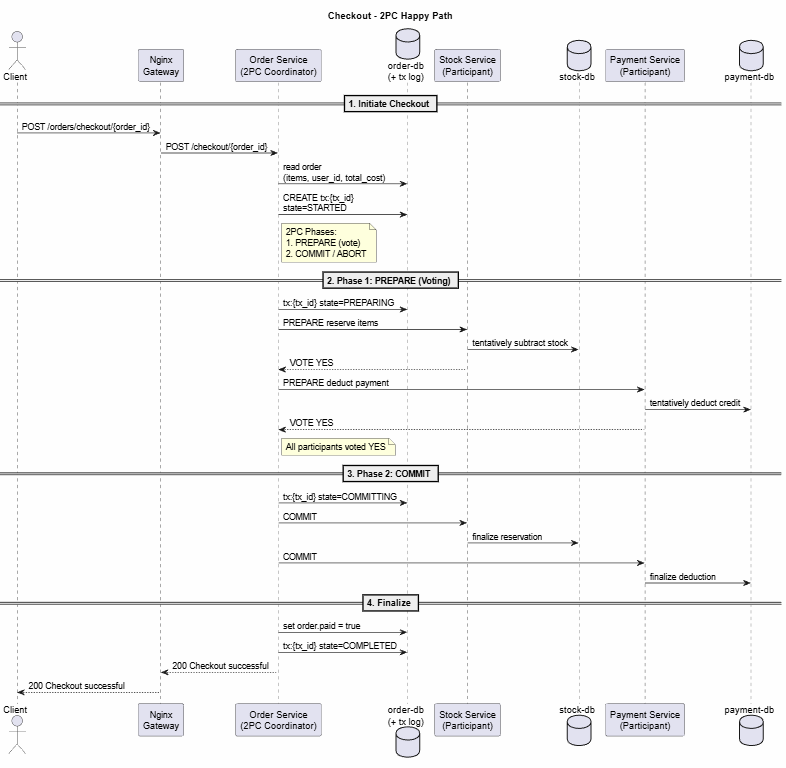
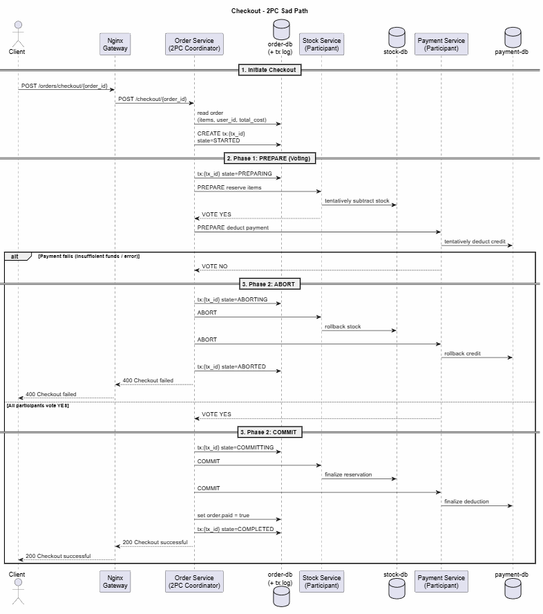

# Two-Phase Commit (2PC) — Distributed Shopping Cart

A distributed shopping cart system using the **Two-Phase Commit (2PC)** protocol to guarantee consistency across three microservices: **Order**, **Stock**, and **Payment**.

---

## What is 2PC?

Two-Phase Commit is a distributed transaction protocol that ensures all services either **commit** or **abort** together — no partial updates.

```
┌───────────────────────────────────────────────────────────────────────┐
│                        2PC PROTOCOL FLOW                              │
│                                                                       │
│   PHASE 1: PREPARE (Voting)                                          │
│   ─────────────────────────                                          │
│   Coordinator → Stock:   "Can you reserve 2x ItemA, 1x ItemB?"      │
│   Stock → Coordinator:   "YES" (stock subtracted tentatively)        │
│                                                                       │
│   Coordinator → Payment: "Can you deduct $50 from User123?"          │
│   Payment → Coordinator: "YES" (credit deducted tentatively)         │
│                                                                       │
│   DECISION: All voted YES → COMMIT                                    │
│                                                                       │
│   PHASE 2: COMMIT                                                     │
│   ───────────────                                                     │
│   Coordinator → Stock:   "COMMIT" (reservation cleared)              │
│   Coordinator → Payment: "COMMIT" (reservation cleared)              │
│                                                                       │
│   ─── OR if any participant votes NO: ───                            │
│                                                                       │
│   PHASE 2: ABORT                                                      │
│   ──────────────                                                      │
│   Coordinator → Stock:   "ABORT" (stock restored)                    │
│   Coordinator → Payment: "ABORT" (credit restored)                   │
└───────────────────────────────────────────────────────────────────────┘
```

### Key Idea

During **PREPARE**, each participant tentatively applies the change (subtracts stock or credit) and stores a reservation record. This guarantees that if the coordinator says COMMIT, the participant *can* commit (because it already did the work). If the coordinator says ABORT, the participant reads the reservation and undoes the change.

---

## Architecture

```
         ┌─────────────┐
         │   NGINX      │  ← API Gateway (port 8000)
         │   Gateway    │
         └──────┬───────┘
                │
       ┌────────┼────────┐
       │        │        │
       ▼        ▼        ▼
  ┌─────────┐ ┌──────┐ ┌─────────┐
  │  Order   │ │Stock │ │ Payment │  ← Flask microservices
  │ Service  │ │Svc   │ │ Service │
  │(COORD.)  │ │(PART)│ │ (PART)  │
  └────┬─────┘ └──┬───┘ └────┬────┘
       │          │          │
       ▼          ▼          ▼
  ┌─────────┐ ┌──────┐ ┌─────────┐
  │order-db  │ │stock │ │payment  │  ← Redis databases
  │ (Redis)  │ │-db   │ │-db      │
  └──────────┘ └──────┘ └─────────┘
```

- **Order Service** = 2PC **Coordinator** — orchestrates the transaction
- **Stock Service** = 2PC **Participant** — reserves/releases items
- **Payment Service** = 2PC **Participant** — reserves/releases credit

---

## 2PC Endpoints

### Stock Service (`/stock/2pc/...`)

| Endpoint | Method | Body | Description |
|---|---|---|---|
| `/2pc/prepare/<tx_id>` | POST | `{"items": [["item-id", qty], ...]}` | Check stock, subtract tentatively, vote YES/NO |
| `/2pc/commit/<tx_id>` | POST | — | Delete reservation (stock already subtracted) |
| `/2pc/abort/<tx_id>` | POST | — | Restore stock from reservation, delete record |

### Payment Service (`/payment/2pc/...`)

| Endpoint | Method | Body | Description |
|---|---|---|---|
| `/2pc/prepare/<tx_id>` | POST | `{"user_id": "...", "amount": 100}` | Check credit, subtract tentatively, vote YES/NO |
| `/2pc/commit/<tx_id>` | POST | — | Delete reservation (credit already deducted) |
| `/2pc/abort/<tx_id>` | POST | — | Restore credit from reservation, delete record |

### Order Service (`/orders/checkout/<order_id>`)

The checkout endpoint acts as the 2PC coordinator:
1. Generates a unique `tx_id`
2. Sends PREPARE to Stock → if NO, return failure
3. Sends PREPARE to Payment → if NO, ABORT Stock, return failure
4. Both YES → sends COMMIT to both → mark order as paid

---

## How to Run

### Prerequisites

- **Docker** and **Docker Compose** installed
- Make sure port **8000** is free

### Start the System

```bash
cd 2pc
docker-compose up --build
```

This starts 7 containers:
- `gateway` (nginx on port 8000)
- `order-service`, `stock-service`, `payment-service`
- `order-db`, `stock-db`, `payment-db` (Redis instances)

Wait until you see all services are up (gunicorn workers booting).

### Stop the System

```bash
docker-compose down
```

To also wipe all Redis data:

```bash
docker-compose down -v
```

---

## How to Run the Tests

The tests are in the `test/` folder and verify:
- **test_stock**: Create items, add/subtract stock, check boundaries
- **test_payment**: Create users, add credit, make payments
- **test_order**: Full 2PC checkout flow — tests failure rollback AND successful commit

### Step 1: Start the system

```bash
cd 2pc
docker-compose up --build
```

### Step 2: Run tests (in a separate terminal)

```bash
cd 2pc
python3 -m unittest test.test_microservices -v
```

### Expected Output

```
test_order (test.test_microservices.TestMicroservices) ... ok
test_payment (test.test_microservices.TestMicroservices) ... ok
test_stock (test.test_microservices.TestMicroservices) ... ok

----------------------------------------------------------------------
Ran 3 tests in X.XXXs

OK
```

### What the `test_order` Test Verifies

1. **Insufficient stock → checkout fails, stock is restored (2PC abort works)**
   - Item2 has 0 stock → Stock PREPARE fails → nothing to abort
   - Item1 stock remains at 15 ✓

2. **Insufficient credit → checkout fails, stock is restored (cross-service abort works)**
   - Stock PREPARE succeeds (items reserved)
   - Payment PREPARE fails (0 credit)
   - Coordinator sends ABORT to Stock → stock restored
   - Item1 stock remains at 15 ✓

3. **Sufficient stock + credit → checkout succeeds (2PC commit works)**
   - Stock PREPARE: YES → items reserved
   - Payment PREPARE: YES → credit reserved
   - COMMIT both → finalized
   - Item1 stock = 14 ✓, credit = 5 ✓

---

## Project Structure

```
2pc/
├── docker-compose.yml        # Multi-container setup
├── gateway_nginx.conf        # Nginx routing config
├── README.md                 # This file
├── env/                      # Redis connection env vars
│   ├── order_redis.env
│   ├── payment_redis.env
│   └── stock_redis.env
├── order/                    # Order Service (2PC Coordinator)
│   ├── app.py                # Flask app + 2PC coordinator logic
│   ├── Dockerfile
│   └── requirements.txt
├── payment/                  # Payment Service (2PC Participant)
│   ├── app.py                # Flask app + 2PC prepare/commit/abort
│   ├── Dockerfile
│   └── requirements.txt
├── stock/                    # Stock Service (2PC Participant)
│   ├── app.py                # Flask app + 2PC prepare/commit/abort
│   ├── Dockerfile
│   └── requirements.txt
└── test/                     # Test suite
    ├── __init__.py
    ├── test_microservices.py  # Unit tests
    └── utils.py              # Test helper functions
```

---

## How 2PC Reservation Records Work

When a participant receives a PREPARE request, it:

1. **Checks** if the operation is possible (enough stock/credit)
2. **Applies** the change tentatively (subtracts stock/credit)
3. **Stores** a reservation record in Redis under key `2pc:<tx_id>`

The reservation record contains what was changed, so:
- **COMMIT** just deletes the record (change is already applied)
- **ABORT** reads the record, undoes the change, then deletes the record

Reservation records have a **TTL (60 seconds)** — if the coordinator crashes and never sends commit/abort, the records expire automatically. This prevents resources from being locked forever.


cd 2pc
docker-compose up --build       # Terminal 1
python3 -m unittest test.test_microservices -v  # Terminal 2

## Appendix: Sequence Diagrams

### Checkout — Happy Path

All 2pc steps succeed: stock is reserved, payment is deducted, and the order is marked as paid.



### Checkout — Sad Path

Although the Stock Service successfully reserves the items and votes YES, the Payment Service fails during the prepare phase and votes NO (e.g., due to insufficient funds).  
The coordinator then aborts the transaction, instructing all participants to roll back their tentative changes.


