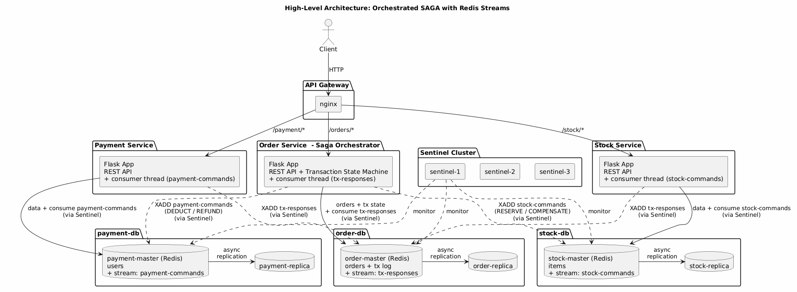
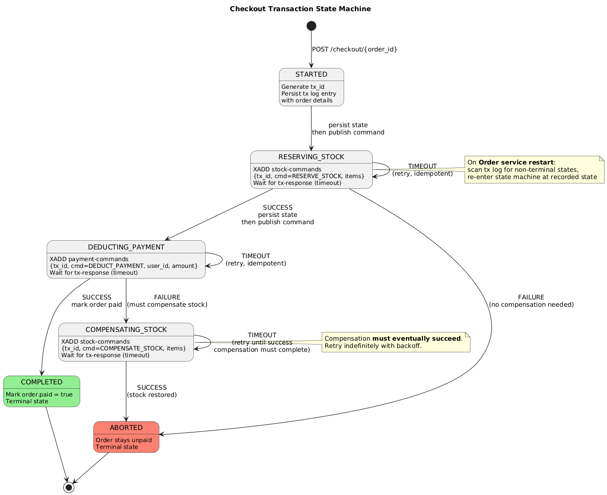
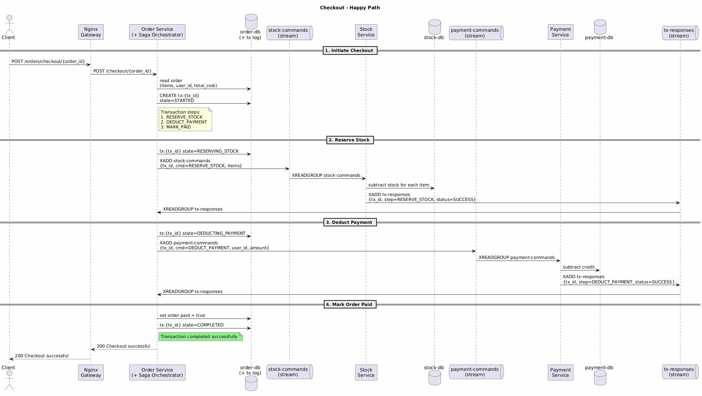
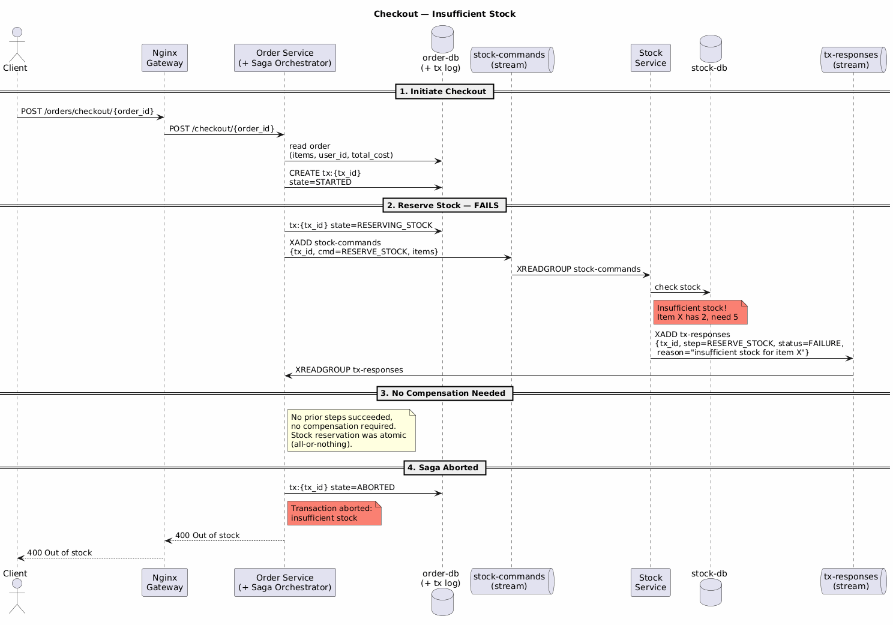
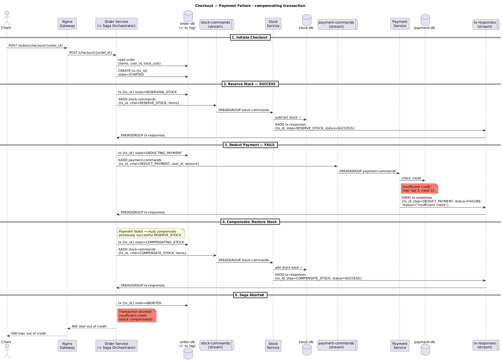

# Shopping Cart System 

### High Level Architecture 

Our project implements a reactive microservice architecture with an orchestrated SAGA pattern for distributed transactions. We use Redis streams as our message broker.
#### Notation used in diagrams
- **XADD** — Append a message to a stream. Used by services to publish commands and responses (e.g., `XADD stock-commands {tx_id, cmd=RESERVE_STOCK, items}`).
- **XREADGROUP** — Read messages from a stream as part of a consumer group.
- **XACK** — Acknowledge a message has been processed. Unacknowledged messages remain in the Pending Entries List (PEL) and are redelivered on consumer restart.
- **tx_id** — Transaction ID. A unique identifier generated per checkout, used as the idempotency key across all saga steps.
- **tx:{tx_id}** — The transaction log entry stored in `order-db`, tracking the current state of the saga (e.g., `STARTED`, `RESERVING_STOCK`, `COMPLETED`, `ABORTED`).

 

### Transaction State Machine 

 

For detailed step-by-step checkout flows, see the [Appendix: Sequence Diagrams](#appendix-sequence-diagrams).

### High Availability Redis: Sentinel

Each Redis master (order-db, stock-db, payment-db) has one async replica and is monitored by 3 shared Sentinel instances. If a master goes down, Sentinel detects the failure (~5s), reaches quorum (2 of 3 must agree), and promotes the replica to master (~10s total). Services will then reconnect automatically.

**Topology:** 3 masters + 3 replicas + 3 sentinels. Replicas are standby-only (no read load balancing) since the workload is write-heavy and stale reads would break consistency.

**Config:** `sentinel/sentinel-{1,2,3}.conf`. Key settings:
- `down-after-milliseconds 5000` — failure detection threshold
- `failover-timeout 10000` — max time to complete failover
- `resolve-hostnames yes` — required for Docker DNS
- `announce-hostnames yes` — announces Docker hostnames (not IPs) after failover

### Reactive Microservice architecture: Redis Streams

Services communicate exclusively through Redis Streams — no synchronous HTTP calls between services. Each service has its own Redis instance with its own command stream:

- **`stock-commands`** (on stock-db) — receives `RESERVE_STOCK`, `COMPENSATE_STOCK`, and `LOOKUP_PRICE` commands
- **`payment-commands`** (on payment-db) — receives `DEDUCT_PAYMENT` and `REFUND_PAYMENT` commands
- **`tx-responses`** (on order-db) — stock and payment services publish their results here; the order service consumes them to drive the SAGA state machine

Each service runs a background consumer thread using **XREADGROUP** with consumer groups. This gives us:
- **Parallel processing** — messages are distributed across consumers (4 replicas x 2 workers = 8 consumers per service), each message delivered to exactly one consumer
- **At-least-once delivery** — messages are only ACKed after successful processing. Unacknowledged messages stay in the Pending Entries List (PEL) and get re-claimed by other consumers after 30s of idle time
- **Crash recovery** — on startup, the order service scans for stuck transactions and re-publishes their commands. Stock/payment consumers periodically claim stale pending messages from dead siblings

### Atomic Operations: Redis Lua Scripting

Stock and payment operations use server-side Lua scripts executed atomically by Redis. This prevents race conditions: the entire read-modify-write cycle runs as a single command with no interleaving from other clients.

**Stock service** (`stock/lua_scripts.py`, registered in `stock/app.py`):
- **LUA_SUBTRACT_STOCK** — Subtract quantity from a single item. Returns the new stock, or error codes for not-found / insufficient stock.
- **LUA_SUBTRACT_STOCK_BATCH** — All-or-nothing batch subtract across multiple items. Two-phase: validates all items have sufficient stock first, then decrements all atomically. Used by the SAGA `RESERVE_STOCK` step.
- **LUA_ADD_STOCK** — Add quantity to a single item. Used by the REST endpoint and SAGA `COMPENSATE_STOCK` step.

**Payment service** (inline in `payment/app.py`):
- **LUA_SUBTRACT_CREDIT** — Deduct credit from a user. Returns 1 (success), 0 (insufficient credit), or -1 (user not found). Used by the REST endpoint and SAGA `DEDUCT_PAYMENT` step.
- **LUA_ADD_CREDIT** — Add credit to a user. Used by the REST endpoint and SAGA `REFUND_PAYMENT` compensation step.

### Project structure

* `env`
    Folder containing the Redis env variables for the docker-compose deployment
    
* `helm-config` 
   Helm chart values for Redis and ingress-nginx
        
* `k8s`
    Folder containing the kubernetes deployments, apps and services for the ingress, order, payment and stock services.
    
* `order`
    Folder containing the order application logic and dockerfile. 
    
* `payment`
    Folder containing the payment application logic and dockerfile. 

* `stock`
    Folder containing the stock application logic and dockerfile. 

* `test`
    Folder containing some basic correctness tests for the entire system. (Feel free to enhance them)

* `sentinel`
    Sentinel configuration files (one per instance). Each Sentinel monitors all three Redis master groups.

* `common`
    Shared modules: protocol constants, Redis client factory, stream helpers, serialization, idempotency, logging.

### Deployment types:

#### docker-compose (local development)

After coding the REST endpoint logic run `docker-compose up --build` in the base folder to test if your logic is correct
(you can use the provided tests in the `\test` folder and change them as you wish).

***Requirements:*** You need to have docker and docker-compose installed on your machine.

K8s is also possible, but we do not require it as part of your submission.

#### minikube (local k8s cluster)

This setup is for local k8s testing to see if your k8s config works before deploying to the cloud. 
First deploy your database using helm by running the `deploy-charts-minicube.sh` file (in this example the DB is Redis 
but you can find any database you want in https://artifacthub.io/ and adapt the script). Then adapt the k8s configuration files in the
`\k8s` folder to mach your system and then run `kubectl apply -f .` in the k8s folder. 

***Requirements:*** You need to have minikube (with ingress enabled) and helm installed on your machine.

#### kubernetes cluster (managed k8s cluster in the cloud)

Similarly to the `minikube` deployment but run the `deploy-charts-cluster.sh` in the helm step to also install an ingress to the cluster. 

***Requirements:*** You need to have access to kubectl of a k8s cluster.

---

## Appendix: Sequence Diagrams

### Checkout — Happy Path

All SAGA steps succeed: stock is reserved, payment is deducted, and the order is marked as paid.

### Checkout — Insufficient Stock

Stock reservation fails. Since no prior steps succeeded, no compensation is needed. The transaction is aborted.

### Checkout — Payment Failure

Stock reservation succeeds but payment fails. The orchestrator triggers a compensating transaction to restore the reserved stock, then aborts.

