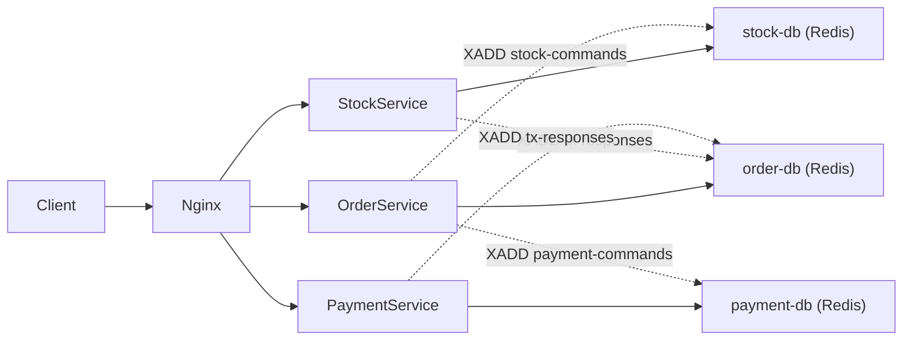

# DDS26-3 Project Plan: 5 Roles for Phase 1 and Phase 2

The project already contains the template microservices (`order/app.py`, `stock/app.py`, `payment/app.py`) using Flask + Redis, an nginx gateway, and docker-compose. Architecture diagrams in `diagrams/` outline the planned orchestrated SAGA approach using Redis Streams.

The core design (already diagrammed) is:
- **Order Service** acts as the SAGA orchestrator
- **Redis Streams** for async command/response messaging between services
- **Transaction log** in order-db for fault-tolerance recovery
- **State machine**: STARTED -> RESERVING_STOCK -> DEDUCTING_PAYMENT -> COMPLETED (or COMPENSATING_STOCK -> ABORTED)



---

## Role Assignments

### Role 1: Stock Service Developer

**Responsibility**: Make the Stock Service transactional, idempotent, and stream-aware.

#### Phase 1 Steps

1. **Add Redis Lua scripts for atomic stock operations** in `stock/app.py`: Write a Lua script that does `GET -> decode -> check -> subtract -> SET` atomically, preventing race conditions where two concurrent checkouts both read the same stock value. Do the same for `add`. This replaces the current non-atomic read-modify-write pattern (lines 97-109).

2. **Add a Redis Stream consumer thread** that listens on a `stock-commands` stream in `stock-db`. On startup, create a consumer group. In a background thread, call `XREADGROUP` in a loop. Parse incoming commands (`RESERVE_STOCK`, `COMPENSATE_STOCK`) and dispatch them.

3. **Implement `RESERVE_STOCK` handler**: Given a `tx_id` and list of `(item_id, quantity)` pairs, atomically subtract all items. If any item fails, roll back the ones already subtracted. Write the result to `tx-responses` stream in `order-db` (requires a second Redis connection to order-db).

4. **Implement `COMPENSATE_STOCK` handler**: Given a `tx_id` and items, add stock back. Always succeeds. Write `SUCCESS` to `tx-responses`.

5. **Idempotency**: Store processed `tx_id`s in a Redis set (e.g., `processed:stock:{tx_id}`) with a TTL. Before processing a command, check if already processed; if so, re-send the same response without re-executing.

6. **Keep existing REST endpoints working** (`/find`, `/add`, `/subtract`, `/item/create`) -- the benchmark tests use them directly.

#### Phase 2 Steps

7. Strip out the stream consumer thread and SAGA-specific logic. Replace with calls to the new shared Orchestrator library (provided by Role 5). The stock service only needs to register its "reserve" and "compensate" handlers with the orchestrator SDK.

---

### Role 2: Payment Service Developer

**Responsibility**: Make the Payment Service transactional, idempotent, and stream-aware.

#### Phase 1 Steps

1. **Add Redis Lua scripts for atomic credit operations** in `payment/app.py`: A Lua script that does `GET -> decode -> check credit >= amount -> subtract -> SET` atomically. Same for `add_funds`. This replaces the current non-atomic pattern (lines 94-106).

2. **Add a Redis Stream consumer thread** that listens on `payment-commands` stream in `payment-db`. Same pattern as Stock: consumer group, `XREADGROUP` loop in a background thread.

3. **Implement `DEDUCT_PAYMENT` handler**: Given `tx_id`, `user_id`, and `amount`, atomically deduct credit. If insufficient, return `FAILURE`. Write result to `tx-responses` in `order-db`.

4. **Implement `REFUND_PAYMENT` handler**: Given `tx_id`, `user_id`, and `amount`, add credit back. Always succeeds. Write `SUCCESS` to `tx-responses`. (Note: in the current state machine, payment compensation is not needed because payment is the last step before completion, but implement it anyway for completeness and for handling edge cases like timeouts.)

5. **Idempotency**: Same pattern as Stock -- track processed `tx_id`s in a Redis set with TTL.

6. **Keep existing REST endpoints working** (`/create_user`, `/find_user`, `/add_funds`, `/pay`).

#### Phase 2 Steps

7. Same as Stock: strip stream consumer, register "deduct" and "refund" handlers with the Orchestrator SDK.

---

### Role 3: Order Service / SAGA Orchestrator Developer

**Responsibility**: Rewrite the checkout flow in the Order Service to use the orchestrated SAGA pattern with Redis Streams, including the transaction log and state machine.

#### Phase 1 Steps

1. **Define a `TransactionLog` data model** stored in `order-db` under keys like `tx:{tx_id}`. Fields: `tx_id`, `order_id`, `state` (enum: STARTED, RESERVING_STOCK, DEDUCTING_PAYMENT, COMPENSATING_STOCK, COMPLETED, ABORTED), `items`, `user_id`, `total_cost`, `created_at`. Use msgpack for serialization.

2. **Add a Redis Stream consumer thread** in `order/app.py` that listens on `tx-responses` stream in `order-db`. When a response arrives, look up the transaction log, and advance the state machine.

3. **Rewrite `checkout()` endpoint** (line 149): Instead of synchronous REST calls, create a tx log entry with state=STARTED, then publish a `RESERVE_STOCK` command to `stock-commands` stream in `stock-db` (requires Redis connection to stock-db). Update state to RESERVING_STOCK. The response to the client should either:
   - (Option A - simpler) Block with polling/waiting until the transaction reaches a terminal state (COMPLETED or ABORTED), then return 200 or 400. Use a threading Event or poll the tx log.
   - (Option B - stretch) Return immediately with a `tx_id` and provide a status endpoint. The benchmark expects a synchronous response, so **Option A** is recommended.

4. **Implement the state machine transitions** in the consumer thread:
   - `RESERVING_STOCK` + SUCCESS response -> set state=DEDUCTING_PAYMENT, publish `DEDUCT_PAYMENT` to `payment-commands`
   - `RESERVING_STOCK` + FAILURE -> set state=ABORTED
   - `DEDUCTING_PAYMENT` + SUCCESS -> set order.paid=True, set state=COMPLETED
   - `DEDUCTING_PAYMENT` + FAILURE -> set state=COMPENSATING_STOCK, publish `COMPENSATE_STOCK` to `stock-commands`
   - `COMPENSATING_STOCK` + SUCCESS -> set state=ABORTED
   - Timeouts -> retry the current step command

5. **Implement recovery on startup**: Scan all `tx:*` keys. For any in a non-terminal state, re-enter the state machine at the recorded state (re-publish the command for the current step). This handles Order Service crashes.

6. **Thread synchronization**: Use `threading.Event` objects keyed by `tx_id` so the checkout endpoint can block until the consumer thread signals completion.

#### Phase 2 Steps

7. Extract the state machine, tx log, stream publishing, and consumer thread logic into the shared Orchestrator module (collaborate with Role 5). The order service checkout should become a simple call like:
```python
result = orchestrator.run_saga(steps=[
    SagaStep("reserve_stock", command={...}, compensate="compensate_stock"),
    SagaStep("deduct_payment", command={...}, compensate="refund_payment"),
], on_success=lambda: mark_order_paid(order_id))
```

---

### Role 4: Infrastructure, Testing, and Fault Tolerance

**Responsibility**: Docker/deployment configuration, testing, benchmarking, and fault tolerance validation.

#### Phase 1 Steps

1. **Update `docker-compose.yml`**: Each service needs access to other services' Redis for stream messaging. Add environment variables for cross-service Redis connections (e.g., `ORDER_REDIS_HOST`, `STOCK_REDIS_HOST`, `PAYMENT_REDIS_HOST`) to each service. Add health checks for all containers. Consider adding `restart: always` policies.

2. **Add Redis persistence config**: Update Redis commands in docker-compose to enable AOF (append-only file) persistence: `redis-server --requirepass redis --maxmemory 512mb --appendonly yes`. This ensures Redis data survives container restarts.

3. **Update `gateway_nginx.conf`**: Add retry/failover configuration, increase timeouts for checkout which is now async internally.

4. **Write consistency tests**: Extend `test/test_microservices.py` with:
   - Concurrent checkout tests (multiple checkouts on same items to verify no overselling)
   - Credit consistency tests (total credit in system is conserved)
   - Checkout failure + rollback verification (stock is restored after payment failure)

5. **Write fault tolerance tests**:
   - Script that runs a checkout, kills a container mid-transaction (using `docker kill`), waits for recovery, and verifies consistency
   - Test killing each of the 3 Redis databases and each of the 3 services independently

6. **Set up the benchmark**: Get the [wdm-project-benchmark](https://github.com/delftdata/wdm-project-benchmark) running locally. Profile latency and throughput. Document results.

7. **Scaling configuration**: Add `deploy.replicas` to docker-compose for each service (e.g., 2 replicas of each service). Verify the system still works with multiple instances (consumer groups handle this naturally).

#### Phase 2 Steps

8. Update docker-compose and infrastructure for the new orchestrator module. Add any new containers if needed.
9. Re-run all consistency and fault tolerance tests against the refactored system.
10. Produce final benchmark numbers and comparison between Phase 1 and Phase 2.

---

### Role 5: Orchestrator Library Developer (Phase 2 lead, Phase 1 support)

**Responsibility**: In Phase 1, support Roles 1-3 with shared utilities. In Phase 2, build the reusable Orchestrator module.

#### Phase 1 Steps

1. **Build shared utilities module** (`common/` directory or a Python package):
   - Redis Stream helper functions: `publish_command(redis_conn, stream, data)`, `create_consumer_group(redis_conn, stream, group)`, `read_messages(redis_conn, stream, group, consumer)`
   - Serialization helpers for stream messages (encode/decode tx commands and responses)
   - Idempotency helper: `is_processed(redis_conn, tx_id, step)` / `mark_processed(redis_conn, tx_id, step)`
   - Logging and monitoring utilities

2. **Define the message protocol** (shared between all services):
   - Command message format: `{tx_id, command, payload (JSON)}`
   - Response message format: `{tx_id, step, status (SUCCESS/FAILURE), reason (optional)}`

3. **Help with integration** across roles: make sure the stream names, consumer group names, and message formats are consistent.

#### Phase 2 Steps

4. **Create the Orchestrator module** (`orchestrator/` directory) as a standalone Python package that can be imported by any service. Core components:
   - `SagaDefinition`: A class where you declare an ordered list of steps, each with a "do" command and a "compensate" command
   - `SagaOrchestrator`: The engine that runs a saga -- publishes commands via Redis Streams, consumes responses, manages the state machine, handles retries and timeouts, persists the tx log
   - `SagaParticipant`: A base class/mixin that services extend -- handles stream consumption, dispatching to registered handlers, idempotency, and response publishing
   - `SagaResult`: Returned to the caller with the outcome (success/failure + reason)

5. **Refactor Order Service** to use the orchestrator:
   - Define the checkout saga as a `SagaDefinition`
   - Call `orchestrator.execute(saga_definition, payload)` in the checkout endpoint
   - The orchestrator handles all state machine logic, tx log, retries, recovery

6. **Refactor Stock and Payment Services** to use `SagaParticipant`:
   - Register handlers: `participant.register("RESERVE_STOCK", reserve_handler, "COMPENSATE_STOCK", compensate_handler)`
   - The participant base class handles stream consumption, idempotency, and response publishing

7. **Write documentation and examples** for the orchestrator module.

---

## Summary Table

| Role | Phase 1 Focus | Phase 2 Focus |
|------|--------------|--------------|
| R1: Stock Service | Atomic ops, stream consumer, RESERVE/COMPENSATE handlers, idempotency | Refactor to use Orchestrator SDK |
| R2: Payment Service | Atomic ops, stream consumer, DEDUCT/REFUND handlers, idempotency | Refactor to use Orchestrator SDK |
| R3: Order / SAGA | Tx log, state machine, checkout rewrite, recovery on restart | Collaborate with R5 to extract orchestrator |
| R4: Infra + Testing | Docker config, Redis persistence, consistency/fault tests, benchmark | Re-test refactored system, final benchmarks |
| R5: Shared Utils / Orchestrator | Stream helpers, message protocol, integration support | Build reusable Orchestrator library |

## Key Technical Decisions

- **SAGA pattern (not 2PC)**: Simpler with Redis, no need for XA. Compensating transactions handle rollback.
- **Redis Streams for messaging**: Already built into Redis, no extra infrastructure. Consumer groups give us load balancing across service replicas.
- **Lua scripts for atomicity**: Redis single-threaded execution of Lua scripts gives us atomic read-modify-write without needing distributed locks.
- **Synchronous checkout response**: The benchmark expects a synchronous HTTP response, so the checkout endpoint blocks (using `threading.Event`) until the saga completes.
- **Idempotent operations**: Critical for retry safety. Each `tx_id + step` combination is processed at most once.
